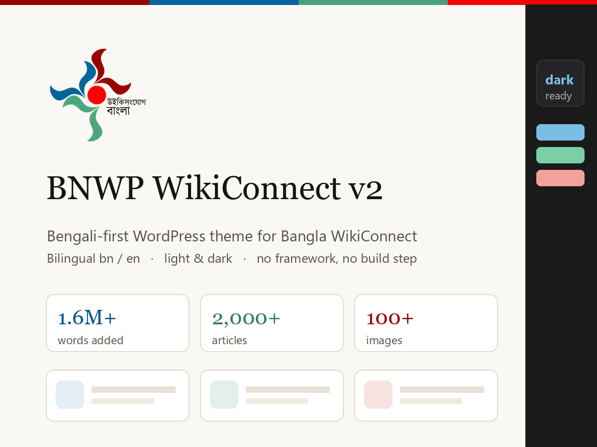

# BNWP WikiConnect v2

A Bengali-first WordPress theme for [Bangla WikiConnect](https://connect.bnwp.org/).
Bilingual, accessible, and deliberately small: no framework, no build step, no
npm. Plain PHP, CSS custom properties and vanilla JavaScript.



---

## What it does

- **One record, two languages.** A post holds its Bengali in the normal title
  and editor, and its English in a panel below. No duplicate posts to keep in
  step.
- **Project and team-member content types**, with a team taxonomy, per-project
  organisers and jury, and external jurors who link off-site.
- **Light and dark themes**, every colour pair measured against WCAG AA.
- **Numbers that localise themselves** — enter `1600000`, get `1.6M+` in
  English and `১৬ লক্ষ+` in Bengali.
- **Wikimedia Commons images** by URL, file-page link or `File:` title,
  resized to a width Commons will actually serve.
- **SEO** — hreflang, Open Graph, Twitter cards, JSON-LD and an `/en/`
  sitemap, all standing aside when Yoast is active and correcting the tags it
  builds without knowing the site is bilingual.

## Requirements

WordPress 6.4+, PHP 7.4+. No other dependencies.

## Installing

**Appearance → Themes → Add New → Upload Theme**, choose the zip, activate.
Then save **Settings → Permalinks** once so the project and member archives
register.

To build the zip from a checkout:

```bash
git archive v2 --prefix=bnwp-wikiconnect-v2/ -o bnwp-wikiconnect-v2.zip
```

---

## Writing content

### Both languages, one screen

Every post, page, project and member has an **English version** panel beneath
the editor: English title, body, excerpt, and the extra fields that type needs.
The Bengali side is the normal WordPress title box and editor.

**Leave anything blank and it falls back to the Bengali**, so a half-translated
record is never an empty page. An **EN** column on each list screen shows what
still needs doing.

Readers switch with the globe button in the header, which moves between
`/about/` and `/en/about/`. The older `?lang=en` addresses still work and
301-redirect to their `/en/` equivalent.

### Adding a project

**Projects → Add New.** Title and editor hold the Bengali. The **Project
Details** box holds:

| Field | Notes |
|---|---|
| Logo, Cover image | Media Library, a full URL, or a Commons `File:Name.svg` title |
| Wiki URL | The Meta or project page; drives the sidebar link |
| Lead | One sentence. Used on cards and as the meta description |
| Timeline | `2025-05-07 - 2025-06-07`. Written out in words in both languages |
| Contest language | The language the contest runs in, not the reader's. Empty means Bangla |
| Organisers, Jury | One person per line — see below |

**Status is not a field.** Ongoing, Upcoming and Completed are read off the
Timeline against today's date, so a contest stops calling itself চলমান the
morning after it ends and nobody has to remember. A project with no timeline
shows no chip.

Listings — the home page and the projects archive — put ongoing first, then
upcoming, then finished, with the most recent start first inside each group.
That order comes from a key rebuilt whenever a project is saved and once a day
on cron, since the answer changes with the calendar rather than with edits.

### Crediting people on a project

**Organisers** and **Jury** are one person per line, shown in the order you
write them. Three shapes, told apart automatically by whether the first field
names somebody on the site.

A wiki username on its own credits that team member, using their photo and
page:

```
Yahya
```

A username followed by a description says what they did **on this project**.
Their standing team role is never shown here — what somebody does on a contest
is rarely what their role on the team says:

```
Wiki username | Bengali description | English description
RiazACU | প্রধান আয়োজক | Lead organiser
```

Somebody with no record on this site — a guest juror invited to this contest
only — takes the long form:

```
Bengali name | English name | Bengali description | English description | Link | Photo
ড. রেহানা সুলতানা | Dr Rehana Sultana | বিশেষ বিচারক | Guest judge | https://example.edu/rsultana | File:Rehana_Sultana.jpg
```

All three mix freely in one field, so a jury of two team members and an outside
academic is three lines. Keep the bars for anything you skip. A username that
matches nobody is shown as plain text rather than dropped, so a typo is visible
on the page instead of silently missing. Leave **Jury** empty and everyone in
the Reviewers team is listed instead.

### Cover image credit

**Cover caption** appears under the cover image and is where the author,
licence and source link go. Basic HTML is allowed, so a real link works:

```
ছবি: Rasel Ahmed, <a href="https://creativecommons.org/licenses/by-sa/4.0/">CC BY-SA 4.0</a>, via Wikimedia Commons
```

There is an English box beside it; leave it empty to use the Bengali.
**Wiki link text** does the same job for the Wiki row of the *At a glance*
panel, which otherwise shows the bare domain.

Projects and team members use the **classic editor**. These records are mostly
fields, and the block editor hides registered meta boxes in a collapsed drawer
under the content where they are easy to miss entirely. Posts and pages keep
the block editor; on those screens the **English version** box sits at the
bottom, below the content.

### Adding a team member

**Team Members → Add New.** Give the slug in Latin lowercase. Fill **Wiki
username** — it is the key that links a person to the projects they work on.
Tick a team (`cot`, `technical`, `jury`) in the Teams box.

| Field | Notes |
|---|---|
| Display name, Role, Location | Role and Location have English twins |
| Wiki username | Links the person to projects; leave empty for non-Wikimedians |
| Profile image | Media Library, a full URL, or a Commons `File:Name.jpg` title |
| External profile URL | Where their card points, instead of a local page |
| Social links | One per line, `Label \| URL`. Shown in an **Elsewhere** panel |

**A standing external member** — someone outside the movement who reviews for
you repeatedly — is worth adding here as a team member: name, photo and their
social links, ticked into the `jury` team. Leave **Wiki username** empty if they
have none; they stay selectable in a project's Jury field, stored by slug.
Setting **External profile URL** makes their cards link straight out, with an
outward arrow, rather than to a thin local page. For a one-off guest on a
single contest, use **Guest jury** on the project instead.

### Ordering team members

Each team member has an **Order** box (in the sidebar, under Attributes). Lower
numbers come first, and **0 means unranked**, so anyone you have not numbered
falls below everyone you have — setting one person to 1 is enough to put them
at the top without touching anybody else. People sharing a number, 0 included,
are alphabetical among themselves.

The number is global: one running order used by the team page, every team
filter and the core-team strip on the home page. Leave gaps (10, 20, 30) and
inserting somebody later means editing one record rather than all of them.

### The navigation menu

**Appearance → Menus.** One menu serves both languages: each item has an
**English label** box under its normal title, and leaving it empty falls back
to the Bengali, the same bargain as everywhere else on the site. Links are
rewritten to `/en/...` automatically, so you never add an item twice.

There is a second location, *Primary Menu (English override)*, for the rare
case of wanting a genuinely different English structure. Leave it unassigned
unless you need it — an assigned menu there is a second thing to maintain, and
that is precisely how the two menus drifted apart before.

### Ordering the teams themselves

**Team Members → Teams** gives each team an **Order** box, working the same way
as the one on a person: lowest first, 0 meaning unranked and sorting last. It
sets the order of the filter row on the team page, the badges on a profile and
the team links in the sitemap.

Out of the box the theme uses Core team, Reviewers, Technical team, then Former
members, without anything being configured. Setting a number on a team
overrides that for that team.

### Former members

Tick a person into the **Former members** team. They drop out of the main team
listing and the home page, and reappear under a *Former members* heading at the
foot of the team page. Their profile, and every project that credits them, are
untouched — past work stays theirs. Removing the tick puts them straight back.

### Adding a post

**Posts → Add New**, as normal, plus the English panel. The **BNWP Post
Details** box adds the author's wiki username, which links to their Meta
profile.

---

## Settings without code

**Appearance → Customise**

**Home page text** holds every heading, button and paragraph on the front page.
Each box takes `Bengali | English`:

```
আমাদের প্রকল্পসমূহ | Our projects
```

Leave a box empty and the theme's own wording is used — the grey placeholder
shows you what that is. Leave the English half empty and English readers see
the Bengali, the same fallback the rest of the site uses. Nothing on the home
page needs a template edit any more.

| Section | Format, one row per line |
|---|---|
| **Impact numbers** | `number \| Bengali label \| English label` |
| **Partners** | `Bengali name \| English name \| URL \| image` |
| **Social channels** | `Label \| URL \| icon` |

Impact numbers take a plain number and scale it for each language — English
short scale (K/M/B), Bengali South Asian scale (হাজার/লক্ষ/কোটি). Below 10,000
the number is shown in full. A `+` is appended automatically, and the figure
counts up as it scrolls into view.

Partner images accept a filename shipped with the theme, a full URL, or a
Commons title. Known social icons: `facebook`, `youtube`, `linkedin`,
`telegram`, `github`, `instagram`, `mastodon`.

Team names in English come from an **English name** field on each term under
**Team Members → Teams**, with sensible defaults for the three that ship.

---

## How it is built

### Content types

| Type | Key | Archive |
|---|---|---|
| Projects | `project` | `/projects/` |
| Team members | `persona` | `/persona/` |
| Teams | `team` (taxonomy) | `/teams/{slug}/` |

Important team slugs: `cot`, `technical`, `jury`.

### Meta keys

Bengali values use the base key; English uses the same key with `_en`.

```
_bnwp_logo      _bnwp_cover     _bnwp_wiki      _bnwp_status
_bnwp_lead      _bnwp_lead_en
_bnwp_name      _bnwp_role      _bnwp_role_en
_bnwp_username  _bnwp_location  _bnwp_location_en
_bnwp_email     _bnwp_img       _bnwp_bio       _bnwp_bio_en
_bnwp_link      _bnwp_user
_bnwp_organisers  _bnwp_jury        (comma-separated wiki usernames)
_bnwp_title_en    _bnwp_body_en     _bnwp_excerpt_en
```

`_bnwp_language` and `_bnwp_source_file` are leftovers — the first from the
two-record era, the second from the original Hugo import. Both are still
registered so old records keep their data, but nothing reads them.

### The bilingual layer

`bnwp_current_language()` reads the URL and nothing else — an `/en/` path
prefix, which `bnwp_parse_language_prefix()` strips before WordPress parses the
request, so templates and queries only ever see the Bengali URL.
`bnwp_lang_arg()` puts it back when building links. Three filters do the
swapping — `bnwp_filter_title()`, `bnwp_filter_content()`,
`bnwp_filter_excerpt()` — so templates call `the_title()` and `the_content()`
normally. For meta, `bnwp_get_meta_i18n('_bnwp_lead')` returns `_bnwp_lead_en`
in English when it is set.

### Images

`bnwp_image()` is the single entry point. It hands Media Library files to
`wp_get_attachment_image()` so WordPress serves a generated size with a
`srcset`, and rewrites Commons URLs to thumbnails.

**Commons serves thumbnails only at 120, 250, 500, 960, 1280 and 1920 px** and
returns 400 for anything else. `bnwp_commons_width()` snaps any request up to
the next allowed size. Do not remove it — every Commons image breaks without it.

Every external image carries an `onerror` fallback, because Commons files do
occasionally get deleted.

### Files

| File | Purpose |
|---|---|
| `functions.php` | Setup, bilingual layer, images, content types, admin, SEO |
| `front-page.php` | Homepage |
| `header.php`, `footer.php` | Shared layout |
| `archive-project.php`, `single-project.php` | Projects |
| `archive-persona.php`, `single-persona.php`, `taxonomy-team.php` | People and teams |
| `page-posts.php`, `page-newsroom.php`, `page-contact.php` | Pages whose content comes from the template |
| `assets/css/app.css` | All styling; tokens at the top |
| `assets/js/app.js` | Colour mode, nav, scroll reveal, count-up |

A page whose content comes from its template is matched by slug, so the
Newsroom page must keep the slug `newsroom` for `page-newsroom.php` to apply.

---

## Development

There is no build step. Edit the PHP and CSS directly.

Before committing, lint:

```bash
for f in *.php; do php -l "$f"; done
```

Do not commit a WordPress install, `wp-config.php`, uploads, or credentials.

## Contributing

Issues and pull requests welcome. Content changes — new projects, people,
translations — are made in the WordPress admin, not here.

## Licence

GPL-2.0-or-later. See [LICENSE](LICENSE) and [COPYRIGHT.md](COPYRIGHT.md).

Images from Wikimedia Commons are mostly CC BY-SA and require attribution;
each uploaded file carries its author and licence in the attachment caption.

## Further reading

[HANDOVER.md](HANDOVER.md) — current state of the site, what is blocked on the
host, the reasoning behind the architecture, and what remains to be done.
